# Домашнее задание 1 по курсу QA команды ЯБлонька

## Тестовое окружение 
1, 2, 6, 7, 8, 9 - Windows, Chrome 106.0.4998.76

3, 4, 5 - Windows 10 (64-bit) 22H2 (build 19045.4046), Firefox 122.0.1

Тестовый аккаунт:
_email_: sss@ss.ss
_password_: a1234567

## Тестируемые части:
1. [Страница авторизации](#страница-авторизации)
2. [Страница регистрации](#страница-регистрации)
3. [Хедер](#хедер)
4. [Страница досок](#страница-досок)
5. [Окно создания рабочего пространства](#окно-создания-рабочего-пространства)
6. [Профиль](#профиль)
7. [Страница доски](#страница-доски)
8. [История изменений доски](#история-изменений)
9. [Ошибка 404](#ошибка-404)
10. [Модальное окно карточки](#модальное-окно-карточки)

# [Страница авторизации](https://nota-tabula.ru/signin)

## Общее

* При переходе авторизованным пользователем на страницу авторизации, пользователя перенаправляет на [страницу досок](https://nota-tabula.ru/main)
* При уменьшении окна по вертикали до:
    - 576px, пропадают иконки рядом с инпутами (человек в поле "Email", замок в поле "Пароль")
* При уменьшении окна по горизонтали до:  
    - 1199px, уменьшаются расстояния между элементами меню и их размеры  
    - 1061px, уменьшаются расстояния между элементами меню и их размеры
    - 575px, пропадают изображения рядом с инпутами (человек в поле "Email", замок в поле "Пароль"), уменьшаются расстояния между элементами меню и их размеры
* В мобильной версии отсутствуют иконки рядом с инпутами (человек в поле "Email", замок в поле "Пароль")

## [Меню входа](https://nota-tabula.ru/signin)

* При нажатии на ссылку "Регистрация" происходит переход на [страницу регистрации](https://nota-tabula.ru/signup) 
* При вводе текста, не имеющего знак '@', в инпуте для email и последующем нажатии на кнопку "Войти", отображается надпись "Некорректный email"
* При вводе отправке пустого поля email, отображается надпись "Некорректный email"
* При вводе неверного email (текста, не имеющего знак '@')/пустого поля email и пустого пароля и последующем нажатии на кнопку "Войти", отображается надпись "Неверный логин или пароль"
* При вводе верного email (текста, имеющего знак '@') и неверного пароля и последующем нажатии на кнопку "Войти", отображается надпись "Неверный логин или пароль"
* При вводе пароля, содержащего что-то кроме латинских букв, цифр, спецсимволов `$*@!?#^$&:;%_`, а также короче 8 символов и последующем нажатии на кнопку "Войти", отображается надпись "Пароль должен содержать лишь латинские буквы, цифры, спецсимволы и быть длиннее 8 символов"
* При вводе email (текста, имеющего знак '@') и пароля, принадлежащим ранее зарегистрированному аккаунту, и последующем нажатии на кнопку "Войти", пользователя перенаправляет на [страницу досок](https://nota-tabula.ru/main)

# [Страница регистрации](https://nota-tabula.ru/signup)

## Общее
* При переходе авторизованным пользователем на страницу регистрации, пользователя перенаправляет на [страницу досок](https://nota-tabula.ru/main)
* При уменьшении окна по вертикали до:
    - 769px, пропадают иконки рядом с инпутом (человек в поле "Email", замок в поле "Пароль", ключ в поле "Повторите пароль")
    - 576px, пропадает текст "Регистрация"
* При уменьшении окна по горизонтали до:  
    - 1199px, уменьшаются расстояния между элементами меню и их размеры, уменьшаются изображения по сторонам 
    - 1061px, уменьшаются расстояния между элементами меню и их размеры, пропадают изображения по сторонам 
    - 575px, пропадают иконки рядом с инпутами (человек в поле "Email", замок в поле "Пароль", ключ в поле "Повторите пароль"), уменьшаются расстояния между элементами меню и их размеры, пропадает текст "Регистрация"
* Уменьшение окна по горизонтали ограничено, по вертикали нет
* В мобильной версии отсутствуют иконки рядом с инпутами (человек в поле "Email", замок в поле "Пароль", ключ в поле "Повторите пароль")

## Меню регистрации

* При нажатии на ссылку на "Уже есть аккаунт?" пользователя перенаправляет на [страницу входа](https://nota-tabula.ru/signin)
* При вводе текста, не имеющего знак '@', в инпуте для email и последующем нажатии на кнопку "Регистрация", отображается надпись "Некорректный email"
* При вводе пустого поля email, пустых инпутов для паролей и последующем нажатии на кнопку "Регистрация", отображается надпись "Некорректный email"
* В случае заполненного текстом, имеющим символ '@', инпута email и пустых инпутов для паролей и при последующем нажатии на кнопку "Регистрация", отображается надпись "Пароль должен содержать лишь латинские буквы, цифры, спецсимволы и быть длиннее 8 символов"
* При вводе текста, содержащего символ '@' в поле email и при вводе пароля, содержащего что-то кроме латинских букв, цифр, спецсимволов `$*@!?#^$&:;%_`, а также короче 8 символов и последующем нажатии на кнопку "Регистрация", отображается надпись "Пароль должен содержать лишь латинские буквы, цифры, спецсимволы и быть длиннее 8 символов", даже если поле подтверждения пусто
* При вводе текста, содержащего символ '@' и при несоответствии паролей в двух инпутах "Пароль" и "Повторите пароль", выводится сообщение "Пароли не совпадают"
* При вводе текста, содержащего знак @ в поле email, при вводе текста, содержащего буквы латиницы/кириллицы, цифры, а также спецсимволы `$*@!?#^$&:;` при условии, что аккаунта с таким email не существует, пользователя перенаправляет на [страницу досок](https://nota-tabula.ru/main)

# Хедер

## Общее

* Хедер присутствует на любой странице, кроме [страницы авторизации](https://nota-tabula.ru/signin) и [страницы регистрации](https://nota-tabula.ru/signup)
* В хедере присутствует логотип, кнопка "Создать" и аватар пользователя
* На странице доски слева от аватара пользователя появляется кнопка для отображения истории

* Если у пользователя нет аватара, отображается плейсхолдер

## Логотип

* Нажатие перенаправляет на [страницу досок](https://nota-tabula.ru/main)
* На мобильных устройствах в портретной ориентации логотип не отображается

## Кнопка "Создать"

* При нажатии на кнопку открывается окно для создания рабочего пространства

## Аватар/плейсхолдер пользователя

* При нажатии на аватар появляется меню пользователя

## Меню пользователя

* Меню пользователя показывает имя, фамилию, почту пользователя, а также содержит кнопки "Доски", "Профиль", "Безопасность", "Выход"
* При нажатии на кнопку "Доски" происходит перенаправление на [страницу досок](https://nota-tabula.ru/main)
* При нажатии на кнопку "Профиль" происходит перенаправление на [страницу изменения данных о профиле](https://nota-tabula.ru/profile)
* При нажатии на кнопку "Безопасность" происходит перенаправление на [страницу изменения пароля пользователя](https://nota-tabula.ru/security)
* При нажатии на кнопку "Выход" происходит выход из аккаунта пользователя

# [Страница досок](https://nota-tabula.ru/main)

## Общее

* Страница состоит из вкладок "Ваши пространства", "Гостевые пространства", списка рабочих пространств и кнопки "Создайте рабочее пространство"

## Вкладка "Ваши пространства"

* В случае отсутствия созданных рабочих пространств отображается текст со ссылкой "У вас пока что нет ни одного рабочего пространства. Создать новое рабочее пространство". "Создать новое рабочее пространство" - ссылка на окно создания рабочего пространства

 
* В случае нажатия на текст "Создать новое рабочее пространство" открывается [окно создания рабочего пространства](https://github.com/Glibusss/homework-1-spring-2024/blob/Nikita_part1/Yablonka.md#%D0%BE%D0%BA%D0%BD%D0%BE-%D1%81%D0%BE%D0%B7%D0%B4%D0%B0%D0%BD%D0%B8%D1%8F-%D1%80%D0%B0%D0%B1%D0%BE%D1%87%D0%B5%D0%B3%D0%BE-%D0%BF%D1%80%D0%BE%D1%81%D1%82%D1%80%D0%B0%D0%BD%D1%81%D1%82%D0%B2%D0%B0)

  
* В случае нажатия на вкладку "Гостевые пространства" происходит переход на [вкладку "Гостевые пространства"](https://github.com/Glibusss/homework-1-spring-2024/blob/Nikita_part1/Yablonka.md#%D0%B2%D0%BA%D0%BB%D0%B0%D0%B4%D0%BA%D0%B0-%D0%B3%D0%BE%D1%81%D1%82%D0%B5%D0%B2%D1%8B%D0%B5-%D0%BF%D1%80%D0%BE%D1%81%D1%82%D1%80%D0%B0%D0%BD%D1%81%D1%82%D0%B2%D0%B0)

* В случае наличия одного или более созданных рабочих пространств отображается список созданных рабочих пространств. Справа от названия отображается [кнопка "Действие"](https://github.com/Glibusss/homework-1-spring-2024/blob/Nikita_part1/Yablonka.md#%D0%BA%D0%BD%D0%BE%D0%BF%D0%BA%D0%B0-%D0%B4%D0%B5%D0%B9%D1%81%D1%82%D0%B2%D0%B8%D0%B5-%D0%B4%D0%BB%D1%8F-%D1%81%D0%BE%D0%B7%D0%B4%D0%B0%D0%BD%D0%BD%D1%8B%D1%85-%D1%80%D0%B0%D0%B1%D0%BE%D1%87%D0%B8%D1%85-%D0%BF%D1%80%D0%BE%D1%81%D1%82%D1%80%D0%B0%D0%BD%D1%81%D1%82%D0%B2), под названием [кнопка "Создать доску"](https://github.com/Glibusss/homework-1-spring-2024/blob/Nikita_part1/Yablonka.md#%D0%BA%D0%BD%D0%BE%D0%BF%D0%BA%D0%B0-%D1%81%D0%BE%D0%B7%D0%B4%D0%B0%D1%82%D1%8C-%D0%B4%D0%BE%D1%81%D0%BA%D1%83)

* В случае нажатия на название существующего рабочего пространства название превращается в поле изменения названия

## Изменения названия рабочего пространства

* При вводе не пустой строки (кириллица, латиница, цифры, допустимые спецсимволы) название сохраняется. **_Баг_** При вводе строки ``남자 여자 恋人とかもう飽き飽\"'|`<>/()+=.,~№{}[]`` название сохраняется

## Кнопка "Действие" для созданных рабочих пространств

* При нажатии на кнопку появляется [меню действий для рабочего пространства](https://github.com/Glibusss/homework-1-spring-2024/blob/Nikita_part1/Yablonka.md#%D0%BC%D0%B5%D0%BD%D1%8E-%D0%B4%D0%B5%D0%B9%D1%81%D1%82%D0%B2%D0%B8%D0%B9-%D0%B4%D0%BB%D1%8F-%D1%80%D0%B0%D0%B1%D0%BE%D1%87%D0%B5%D0%B3%D0%BE-%D0%BF%D1%80%D0%BE%D1%81%D1%82%D1%80%D0%B0%D0%BD%D1%81%D1%82%D0%B2%D0%B0)

* При повторном нажатии на кнопку "Действие" при активном меню действий меню скрывается

* При нажатии на пустое пространство при активном меню действий меню скрывается

* При нажатии на [кнопку "Создать доску"](https://github.com/Glibusss/homework-1-spring-2024/blob/Nikita_part1/Yablonka.md#%D0%BA%D0%BD%D0%BE%D0%BF%D0%BA%D0%B0-%D1%81%D0%BE%D0%B7%D0%B4%D0%B0%D1%82%D1%8C-%D0%B4%D0%BE%D1%81%D0%BA%D1%83) при активном меню действий меню скрывается, открывается [окно создания доски](https://github.com/Glibusss/homework-1-spring-2024/blob/Nikita_part1/Yablonka.md#%D0%BE%D0%BA%D0%BD%D0%BE-%D1%81%D0%BE%D0%B7%D0%B4%D0%B0%D0%BD%D0%B8%D1%8F-%D0%B4%D0%BE%D1%81%D0%BA%D0%B8)

* При нажатии на [вкладку "Гостевые пространства"](https://github.com/Glibusss/homework-1-spring-2024/blob/Nikita_part1/Yablonka.md#%D0%B2%D0%BA%D0%BB%D0%B0%D0%B4%D0%BA%D0%B0-%D0%B3%D0%BE%D1%81%D1%82%D0%B5%D0%B2%D1%8B%D0%B5-%D0%BF%D1%80%D0%BE%D1%81%D1%82%D1%80%D0%B0%D0%BD%D1%81%D1%82%D0%B2%D0%B0) при активном меню действий меню скрывается, вкладка меняется. **_Баг_** - меню остаётся активным, вкладка меняется_

* При нажатии на [кнопку "Создайте рабочее пространство"](https://github.com/Glibusss/homework-1-spring-2024/blob/Nikita_part1/Yablonka.md#%D0%BA%D0%BD%D0%BE%D0%BF%D0%BA%D0%B0-%D1%81%D0%BE%D0%B7%D0%B4%D0%B0%D0%B9%D1%82%D0%B5-%D1%80%D0%B0%D0%B1%D0%BE%D1%87%D0%B5%D0%B5-%D0%BF%D1%80%D0%BE%D1%81%D1%82%D1%80%D0%B0%D0%BD%D1%81%D1%82%D0%B2%D0%B0) при активном меню действий меню скрывается, открывается [окно создания рабочего пространства](https://github.com/Glibusss/homework-1-spring-2024/blob/Nikita_part1/Yablonka.md#%D0%BE%D0%BA%D0%BD%D0%BE-%D1%81%D0%BE%D0%B7%D0%B4%D0%B0%D0%BD%D0%B8%D1%8F-%D1%80%D0%B0%D0%B1%D0%BE%D1%87%D0%B5%D0%B3%D0%BE-%D0%BF%D1%80%D0%BE%D1%81%D1%82%D1%80%D0%B0%D0%BD%D1%81%D1%82%D0%B2%D0%B0)

* При нажатии на аватар/плейсхолдер пользователя при активном меню действий меню скрывается, появляется [меню пользователя](https://github.com/Glibusss/homework-1-spring-2024/blob/Nikita_part1/Yablonka.md#%D0%BC%D0%B5%D0%BD%D1%8E-%D0%BF%D0%BE%D0%BB%D1%8C%D0%B7%D0%BE%D0%B2%D0%B0%D1%82%D0%B5%D0%BB%D1%8F)

## Меню действий для рабочего пространства

* При нажатии на кнопку "Изменить название" меню скрывается, включается ввод названия. **_Баг_** - меню скрывается, ничего не происходит_

## Кнопка "Создать доску"

* При нажатии на кнопку открывается [окно создания доски](https://github.com/Glibusss/homework-1-spring-2024/blob/Nikita_part1/Yablonka.md#%D0%BE%D0%BA%D0%BD%D0%BE-%D1%81%D0%BE%D0%B7%D0%B4%D0%B0%D0%BD%D0%B8%D1%8F-%D0%B4%D0%BE%D1%81%D0%BA%D0%B8)

## Окно создания доски

* Требования к названию доски: "Название доски может содержать лишь буквы кириллицы и латиницы, цифры, спецсимволы $@!?#^:;%'"\*_ и быть не пустым"

* В случае если инпут "Название доски" оставлен пустым, кнопка "Создать" неактивна
* При вводе строки из пробелов в поле "Название доски" под ним отображается предупреждение о допустимых символах

* В случае если в инпуте "Название доски" заполнено некорректно (содержит один или более спецсимволов "&|`<>/()+=.,~№{}[]", не входящих в допустимые, либо имеет буквы не латиницы/кириллицы, либо иероглифы) под полем отображается предупреждение о допустимых символах

## Вкладка "Гостевые пространства"

* В случае отсутствия гостевых рабочих пространств отображается текст "Вы пока что не приглашены ни в одно рабочее пространство"

   
* В случае присутствия гостевых рабочих пространств (пользователь был приглашён в одну или более досок) отображается список рабочих пространств, в каждом пространстве список досок, в которые он был приглашён

* В случае если нажата вкладка "Ваши пространства" переход на [вкладку "Ваши пространства"](https://github.com/Glibusss/homework-1-spring-2024/blob/Nikita_part1/Yablonka.md#%D0%B2%D0%BA%D0%BB%D0%B0%D0%B4%D0%BA%D0%B0-%D0%B2%D0%B0%D1%88%D0%B8-%D0%BF%D1%80%D0%BE%D1%81%D1%82%D1%80%D0%B0%D0%BD%D1%81%D1%82%D0%B2%D0%B0)

## Список "Рабочие пространства"

* В случае отсутствия созданных рабочих пространств, список пустой
* В случае наличия одного или более созданных рабочих пространств отображается список созданных рабочих пространств

## Кнопка "Создайте рабочее пространства"

* В случае если нажата кнопка, открывается [окно создания рабочего пространства](https://github.com/Glibusss/homework-1-spring-2024/blob/Nikita_part1/Yablonka.md#%D0%BE%D0%BA%D0%BD%D0%BE-%D1%81%D0%BE%D0%B7%D0%B4%D0%B0%D0%BD%D0%B8%D1%8F-%D1%80%D0%B0%D0%B1%D0%BE%D1%87%D0%B5%D0%B3%D0%BE-%D0%BF%D1%80%D0%BE%D1%81%D1%82%D1%80%D0%B0%D0%BD%D1%81%D1%82%D0%B2%D0%B0)

# [Окно создания рабочего пространства](https://nota-tabula.ru/main)

* При нажатии по пустому пространству вне окна с незаполненными полями окно закрывается
* При нажатии по пустому пространству вне окна с заполненными или незаполненными полями "Название рабочего пространства" и "Описание рабочего пространства" окно закрывается без сохранения изменений
* Если в инпуте названия рабочего пространства находится текст из кириллицы, латиницы, цифр, спецсимволов `$@!?#^:;%'"\*_` длиной 1 и более символов, создается новое рабочее пространство
* При наличии символов, не являющихся кириллицей, латиницей, цифрами или спецсимволами `$@!?#^:;%'"\*_` в инпуте названия рабочего пространства, появляется ошибка "Название рабочего пространства может содержать лишь буквы кириллицы и латиницы, цифры, спецсимволы `$@!?#^:;%'"\*_` и быть не пустым"

* В случае если хотя бы одно из полей "Название рабочего пространства" и "Описание рабочего пространства" не заполнены кнопка "Создать" неактивна

# [Профиль](https://nota-tabula.ru/profile)

## Изменение данных о пользователе ([вкладка "Профиль"](https://nota-tabula.ru/profile))

* При нажатии на вкладку "Безопасность" происходит переход на [вкладку "Безопасность"](https://nota-tabula.ru/security)
* В случае если хотя бы одно из полей "Фамилия" и "Имя" пустое выдается ошибка "имя может содержать лишь буквы кириллицы и латиницы, цифры, спецсимволы $@!?#^:;%'"\*_ и быть не пустым". Поле "О себе" может быть пустым
* В случае если поля "Фамилия" и "Имя" не пустые, но содержат что-либо кроме букв латиницы, кириллицы, цифр и спецсимволов `$@!?#^:;'"\*_`, выдается ошибка "имя может содержать лишь буквы кириллицы и латиницы, цифры, спецсимволы $@!?#^:;%'"\*_ и быть не пустым"
* Ошибка выводится над полем, в котором ошибка в формате "[название поля] может содержать лишь буквы кириллицы и латиницы, цифры, спецсимволы $@!?#^:;%'"\*_ и быть не пустым"
* **_Баг_** Предупреждение о допустимых символах держится непостоянное количество времени перед тем, как исчезнуть -- от нескольких секунд до долей секунды

## Изменение пароля пользователя ([вкладка "Безопасность"](https://nota-tabula.ru/security))

* При нажатии на вкладку "Профиль" происходит переход на [вкладку "Профиль"](https://nota-tabula.ru/profile)
* При вводе пароля, совпадающим с настоящим паролем пользователя, нового пароля имеющего только латинские буквы, цифры, спецсимволы `$*@!?#^&:;%_`, являющимся длиннее 8 символов, и правильном его повторении пароль меняется, выводится сообщение "Данные успешно изменены"
* При неправильном вводе пароля всегда над полем, где были неверно введены данные, выводится ошибка "Пароль должен содержать лишь латинские буквы, цифры, спецсимволы `$*@!?#^$&:;%_` и быть длиннее 8 символов". **_Баг_** - ошибка **всегда** выводится над полем "Повторите новый пароль"
* В случае если новый пароль не совпадает с повторением, выводится сообщение "пароли не совпадают"

## Изменение аватарки пользователя (нажатие по аватарке/плейсхолдеру)

* При нажатии на аватарку/плейсхолдер показывается меню управления аватаром

## Меню управления аватаром

* Если выбран пункт "Изменить аватар" отображается окно изменения аватара

* Если выбран пункт "Удалить аватар" при наличии загруженного аватара, аватар удаляется (заменяется на плейсхолдер)

* Если выбран пункт "Удалить аватар" при отсутствии загруженного аватара (плейсхолдер), пункт нажимается, ничего не происходит

## Окно изменения аватара

* При нажатии на кнопку "Загрузить" отображается системное окно выбора файла изображения с поддерживаемыми типами (`.jpg`, `.jpeg`, `.jfif`, `.pjpeg`, `.pjp`, ``.png`). **_Баг_** При изменении аватара изображение с форматом .png и весом менее 5 МБ перетащенного в отмеченную область _ничего не происходит_
* Ппри сохранении изображения с поддерживаемыми типами (`.jpg`, `.jpeg`, `.jfif`, `.pjpeg`, `.pjp`, ``.png`) и весом более 5МБ аватар не обновляется, в правом нижнем углу страницы отображается предупреждение о том, что размер не должен превышать 5 Мб
* В случае если выбран файл с неподдерживаемым форматом (Например ".mp4") и весом менее 5 МБ при выборе фильтра "Все типы (*.*)" вместо превью отображается текст `avatar-preview`
* При сохранении файла с неподдерживаемым форматом (Например ".mp4") и весом менее 5 МБ при выборе фильтра "Все типы (*.*)" отображается предупреждение о недопустимом типе выводится предупреждение о недопустимом формате. **_Баг_** - аватар сохраняется_

# [Страница доски](https://nota-tabula.ru/workspace/28/board/84)

## Общее
* Если пользователь не авторизован, то его перенаправляет на [страницу логина](https://nota-tabula.ru/signin)
* Ссылка имеет структуру /workspace/число/board/число
* При переходе авторизованным пользователем на несуществующую доску пользователя перенаправляет на [страницу ошибки 404](https://nota-tabula.ru/error)
* При переходе авторизованным пользователем на доску, в которую он не добавлен пользователя перенаправляет на [страницу ошибки 404](https://nota-tabula.ru/error)
* При переходе авторизованным пользователем через адресную строку на существующую доску, в которую он добавлен, пользователь перенаправляется на [страницу доски](https://nota-tabula.ru/workspace/28/board/84)
**_Баг_** - при таком варианте перехода title страницы не отображается в истории посещений браузера
* Некорректное название - это название, не соответствующее условию "Название может содержать лишь буквы кириллицы и латиницы, цифры, спецсимволы $@!?#^:;%'"\*_ и быть не пустым"
## Боковое меню
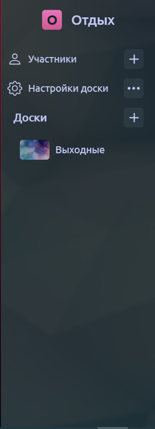
* При размерах ширины экрана менее 545 пикселей пропадают надписи "Участники" и "Настройки доски"
* При вводе количества символов в названии рабочего пространства менее 9, отображается название без scrollbar или скрытия части надписи, розовый квадрат имеет внутри первую букву названия рабочего пространства
* Если название рабочего пространства превышает 8 символов, то под надписью появляется scrollbar, с помощью которого можно полностью посмотреть название
* При такой высоте экрана, что список досок не вмещается, у бокового меню не появляется дополнительного scrollbar, он прокручивается вместе со всей страницей
* При нажатии на доску в левом меню происходит переключение на эту доску
* При нажатии на название доски его можно изменить.
* При нажатии в левом боковом меню на кнопку с тремя точками справа от надписи "Настройки доски" справа от иконки открывается окно.

* При нажатии на вкладку "Удалить доску", пользователя перенаправляет на [страницу досок](https://nota-tabula.ru/main), сама доска исчезает.
* При нажатии на вкладку "Изменить название доски", название доски становится редактируемым, появляется возможность изменить название
* При нажатии в левом боковом меню на кнопку с плюсом справа от надписи "Участники" отображается окно "Добавить пользователя на доску" с инпутом для email

* Если инпут пустой, то кнопка "Добавить" становится бледной
* Если инпут пустой, то при нажатии на кнопку "Добавить" ничего не происходит
* Если инпут пустой, то Кнопка "Удалить" не изменяется визуально, но при клике на неё также ничего не происходит
* При вводе текста, не имеющего символ '@' и последующем нажатии на кнопку "Добавить" отображается надпись "Некорректный email"
* При вводе email пользователя, которого не существует, и последующем нажатии на кнопку "Добавить", отображается надпись "Такого пользователя не существует"
* При вводе email пользователя, который уже на доске, и последующем нажатии на кнопку "Добавить", отображается надпись "Такой пользователь уже на доске"
* При вводе email существующего пользователя, которого нет на доске, и последующем нажатии на кнопку "Добавить", аватар добавленного пользователя отображается левее от кнопки "Сбросить фильтры"
* При вводе email пользователя, который уже на доске, и последующем нажатии на кнопку "Удалить", аватарка пользователя пропадает с доски. **_Баг_** - после удаления пользователя с доски у него не пропадает рабочее пространство при условии, что это была единственная доска, куда добавили пользователя в данном рабочем пространстве
* При вводе email пользователя, которого нет на доске, и последующем нажатии на кнопку "Удалить", отображается надпись "Такого пользователя нет на доске"
* При вводе текста, не имеющего символ '@' и последующем нажатии на кнопку "Удалить" отображается надпись "Некорректный email"

* При нажатии в левом боковом меню на кнопку с плюсом справа от надписи "Доски", вводе названия в окне и нажатии кнопки "Создать" происходит создание новой доски
* В случае если инпут для названия доски пустой, кнопка "Создать" становится бледной
* При вводе названия доски, имеющего что-либо кроме букв латиницы, кириллицы, цифр и спецсимволов `$@!?#^:;%'"\*_` выводится сообщение "Название доски может содержать лишь буквы кириллицы и латиницы, цифры, спецсимволы $@!?#^:;%'"\*_ и быть не пустым".
* При вводе названия, не имеющего ничего кроме букв латиницы, кириллицы, цифр и спецсимволов `$@!?#^:;%'"\*_`, под надписью "Доски" в конце списка появляется новая доска с ранее введённым названием.
* **_Баг_** - При клике на доску, на которой пользователь сейчас находится, происходит перерендер страницы. Адрес не меняется
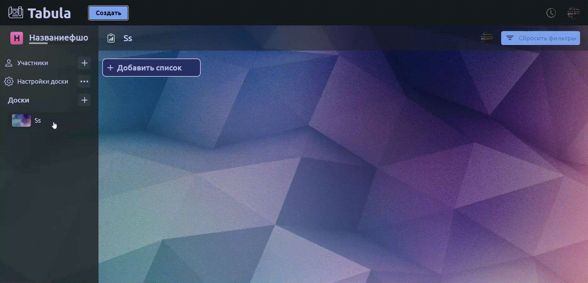
* При клике на другую доску происходит переход на другую доску. Адрес меняется в соответствии с формой /workspace/число/board/число
## Доска
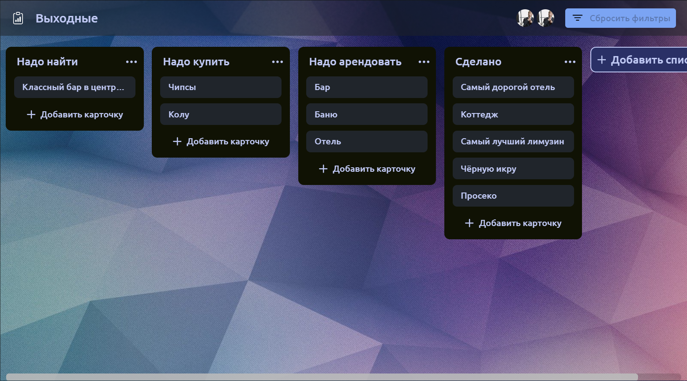
* При клике на кнопку "Добавить список" открывается чёрное окно с инпутом названия списка, кнопкой "Добавить список" и крестиком
    * При нажатии на крестик окно закрывается
    * При вводе названия, имеющего что-либо кроме букв латиницы, кириллицы, цифр и спецсимволов `$@!?#^:;%'"\*_` отображается ошибка "Некорректное название"
    * В случае если инпут пустой, кнопка "Добавить список" становится бледной. При клике на неё ничего не происходит
    * В случае ввода названия, не содержащего ничего кроме букв латиницы, кириллицы, цифр и спецсимволов `$@!?#^:;%'"\*_`, и нажатии на кнопку "Добавить список" справа от последнего списка появляется новый список с введённым ранее названием
    * При вводе слишком длинного названия(которое не вмещается в список), оно обрывается с многоточием на конце.
    * При создании нельзя ввести название более 32 символов
    * При вводе названия, закрытии окна и последующем открытии введённое название пропадает
* При добавлении количества списков, которое не влезает в экран, внизу доски появляется горизонтальный скроллбар
* При нажатии по названию списка, оно становится редактируемым
* При нажатии в правом верхнем углу списка карточек на 3 точки, после чего в открывшемся меню на вкладку "Изменить название списка" название списка становится редактируемым. **_Баг_** - при изменении названия допускается ввод более 32 символов
* При вводе названия без символов изменения отменяются и возвращается прежнее название
* При нажатии в правом верхнем углу списка на три точки, после чего в открывшемся меню на пункт "Удалить", список удаляется
* При нажатии на надпись "Добавить карточку" в любом списке карточек, появляется окно с полем ввода названия карточки и кнопками "Добавить карточку" и крестиком.
    * При нажатии на крестик окно закрывается
    * При вводе названия, содержащего что-либо кроме букв латиницы, кириллицы, цифр и спецсимволов `$@!?#^:;%'"\*_`, отображается ошибка "Некорректное название"
    * В случае если инпут пустой, кнопка "Добавить карточку" становится бледной. При клике на неё ничего не происходит
    * В случае ввода названия, не содержащего ничего кроме букв латиницы, кириллицы, цифр и спецсимволов `$@!?#^:;%'"\*_`, и нажатии на кнопку "Добавить карточку" в конце списка появляется новая карточка с введённым ранее названием
    * При вводе слишком длинного названия(которое не вмещается в карточку), оно обрывается с многоточием на конце. 
    * При создании нельзя ввести название более 32 символов
    * При вводе названия, закрытии окна и последующем открытии введённое название пропадает
* При добавлении карточек список растягивается по высоте. При добавлении достаточно большого числа карточек в списке появляется вертикальный скроллбар. При удалении карточек список сжимается по высоте.
* В случае наличия тегов у карточки, они отображаются под названием карточки, карточка в свою очередь растягивается по высоте.
* При нажатии на тег в случае его наличия на карточке происходит фильтрация по тегу: с доски пропадут все карточки, не имеющие этот тег и списки в которых нет карточек с тегом, по которому происходит фильтрация 
* При активной фильтрации доступна кнопка "Сбросить фильтры". Если нажать на кнопку "Сбросить фильтры", то доска вернётся в прежнее состояние
* При удалении тега с доски или открепления от карточки во время включенной фильтрации, карточка пропадет
## Drag-n-drop
* При зажатии курсора на списке карточек(но не на карточке) и перемещении в другое место происходит перемещение списка карточек.
* Список карточек позиционируется относительно другого списка.
    * Если при перемещении списка отпустить клавишу в левой части другого списка, то перемещаемый список будет находиться слева по горизонтальной оси от списка-цели
    * Если отпустить при перемещении списка отпустить клавишу в правой части, то перемещаемый список будет находиться справа по горизонтальной оси от списка-цели
    * Положение по вертикальной оси не учитывается
* Если вывести перемещаемый список за пределы доски и отпустить курсор, то список вернется на своё изначальное положение
* Для перемещения карточки нужно зажать курсор на карточке и передвинуть в другое место.
* Карточка позиционируется относительно другой карточки. 
    * Если при перемещении карточки отпустить курсор выше центра по вертикальной оси другой карточки(в независимости от списка), то новая позиция перемещаемой карточки будет выше карточки-цели. 
    * Если при перемещении карточки отпустить курсор ниже центра по вертикальной оси другой карточки(в независимости от списка), то новая позиция перемещаемой карточки будет ниже карточки-цели.
    * Положение по горизонтальной оси не учитывается
* Если переместить карточку на список карточек(например, на название), то карточка будет в начале списка
* Для разных размеров устройства доска не меняется, то, что не видно выходит за экран, появляется скроллбар внизу доски.
* Для разных размеров устройства меняется шапка доски. При уменьшении ширины экрана происходят изменения на шапке доски в такой последовательности: 1) Уменьшается иконка около надписи "Сбросить фильтры"; 2) Надпись "Сбросить фильтры" располагается на 2 строках; 3)Пропадает надпись "Сбросить фильтры" и аватарки пользователей; 4) В случае очень длинного названия доски появляется scrollbar под ней

# [История изменений](https://nota-tabula.ru/workspace/28/board/84)

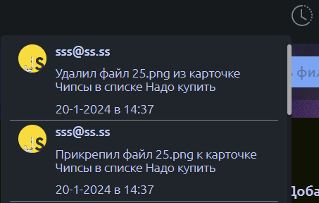
## Общее
* При нажатии нажать на иконку "Часы" в правом верхнем углу страницы доски появляется окно, отображающее историю изменений
* При переносе элемента, появляется его более тусклая версия на изначальной позиции
* На мобильных устройствах Drag-n-Drop
## Действия с доской
* При создании доски добавляется первая запись в формате "[имя пользователя] создал доску [название доски]"
* При переименовании доски добавляется новая запись в формате "[имя пользователя] переименовал доску [старое название доски] на [новое название доски]"
## Действия со списком
* При создании списка добавляется запись в формате "[имя пользователя] создал список [название списка]"
* При перемещении списка новая запись не добавляется
* При переименовании списка добавляется новая запись в формате "[имя пользователя] переименовал список [старое название списка] на [новое название списка]"
* При удалении списка появляется новая запись в формате "[имя пользователя] удалил список [название списка]"
## Действия с карточкой
* При добавлении карточки появляется новая запись в формате "[имя пользователя] создал карточку [название карточки] в списке [название списка]"
* При перемещении карточки добавляется новая запись в формате "[имя пользователя] переместил карточку [название карточки] из 
списка [название списка] в список [название нового списка]"
* При переименовании карточки добавляется новая запись в формате "[имя пользователя] переименовал карточку [старое название карточки] на [новое название карточки]"
* При удалении карточки добавляется новая запись в формате "[имя пользователя] удалил карточку [название карточки] в списке [название списка]"
* При добавлении или изменении описания карточки добавляется новая запись в формате "[имя пользователя] Изменил описание карточки [название карточки] в списке [название списка]"
* При комментировании карточки добавляется новая запись в формате "[имя пользователя] Добавил комментарий в карточке [название карточки] в списке [название списка]"
## Действия с тегом
* При создании тега и прикреплении его на карточку добавляется новая запись в формате "[имя пользователя] создал тег [название тега] и прикрепил его к карточке [название карточки] в списке [название списка]"
* При прикреплении тега к карточке добавляется новая запись в формате "[имя пользователя] прикрепил тег [название тега] к карточке [название карточки] в списке [название списка]"
* При удалении тега с доски добавляется новая запись в формате "[Имя пользователя] удалил тег [название тега] с доски"
* При откреплении тега от карточки добавляется новая запись в формате "[имя пользователя] открепил тег [название тега] от карточки [название карточки] в списке [название списка]"
## Действия с пользователем
* При добавлении пользователя на карточку добавляется новая запись в формате "[имя пользователя] добавил пользователя [имя добавляемого пользователя] на карточку [название карточки] в списке [название списка]"
* При удалении пользователя с карточки добавляется новая запись в формате "[имя пользователя] удалил пользователя [имя добавляемого пользователя] из карточки [название карточки] в списке [название списка]"
## Действия со сроками карточки
* При добавлении, изменении, удалении сроков у карточки добавляется новая запись в формате "[имя пользователя] Обновил сроки выполнения у карточки [название карточки] в списке [название списка]"
## Действия с чеклистом карточки
* При добавлении чеклиста на карточку добавляется новая запись в формате "[имя пользователя] Создал чеклист в карточке [название карточки] в списке [название списка]"
* При добавлении пункта чеклиста добавляется новая запись в формате "[имя пользователя] Создал пункт [название пункта] в чек-листе [название чеклиста] карточки [название карточки] в списке [название списка]"
* При изменении статуса пункта чеклиста добавляется новая запись в формате "[имя пользователя] Обновил пункт [название пункта] в чек-листе [название чеклиста] карточки [название карточки] в списке [название списка]"
* При удалении пункта чеклиста добавляется новая запись в формате "[имя пользователя] Удалил пункт [название пункта] в чек-листе [название чеклиста] карточки [название карточки] в списке [название списка]"
* При удалении чеклиста добавляется новая запись в формате "[имя пользователя] Удалил чек-лист undefined в карточке [название карточки] в списке [название списка]". **_Баг_** - вместо undefined должно быть название чеклиста
## Действия с вложением карточки
* При добавлении вложения на карточку добавляется новая запись в формате "[имя пользователя] Прикрепил файл [название файла] к карточке [название карточки] в списке [название списка]"
* При удалении вложения с карточки добавляется новая запись в формате "[имя пользователя] Удалил файл [название файла] из карточки [название карточки] в списке [название списка]"
* В каждой записи отображается дата и время изменения
* Каждая запись привязана к пользователю и отображает его текущий аватар и email

# [Ошибка 404](https://nota-tabula.ru/404)

## Общее
* Пользователя перенаправляет на страницу ошибки 404, если он ввёл в адресную строку невалидный адрес, либо адрес доски, на которую он не добавлен
* Страница ошибки 404 не заносится в историю посещений браузера
## Для авторизованного пользователя
* Если пользователь авторизован, то на странице 404 присутствует кнопка с надписью "На главную"
* При нажатии на кнопку пользователя перенаправляет на страницу с досками
## Для неавторизованного пользователя
* Если пользователь не авторизован, то на странице 404 присутствует кнопка с надписью "Авторизоваться"
* При нажатии на кнопку пользователя перенаправляет на страницу авторизации

# [Модальное окно карточки](https://nota-tabula.ru/workspace/28/board/84/card/160)

## Общее

* 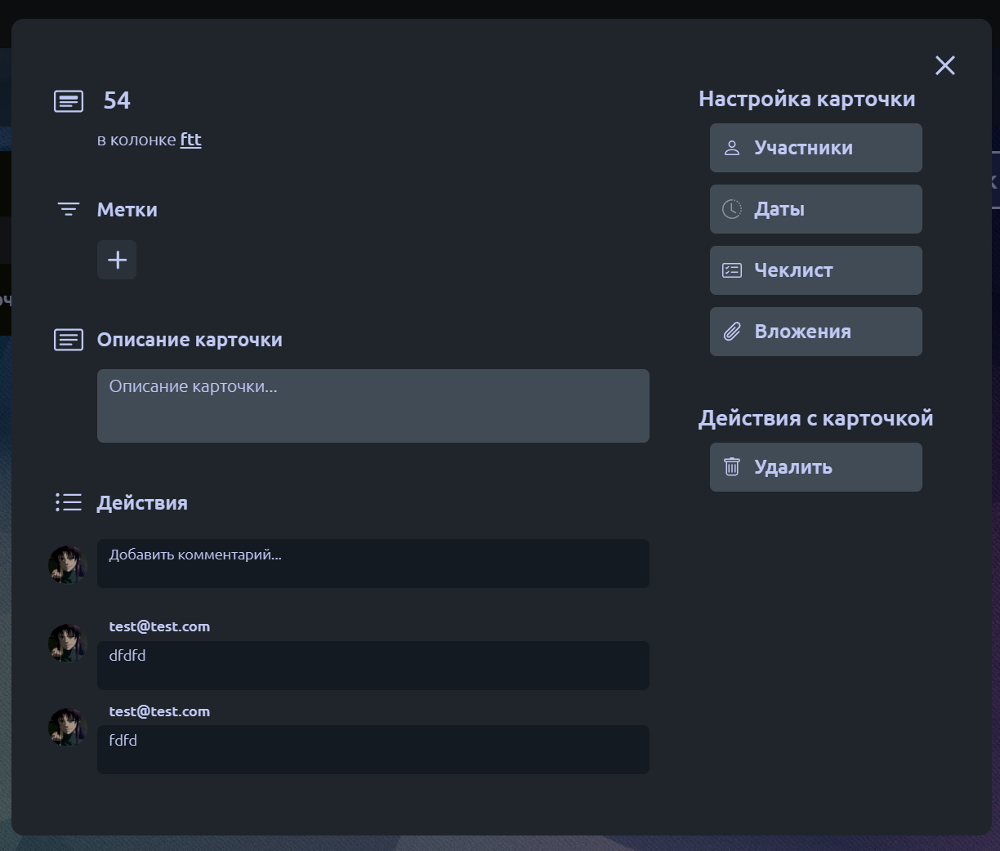

* При нажатии на карточку в списке карточек на доске открывается модалка карточки и изменяется ссылка в строке браузера.
    * Карточка имеет ссылку вида /workspace/число/board/число/card/число.
    * При попытке перейти на несуществующую карточку пользователя переносит на [страницу 404](https://nota-tabula.ru/error).
* В открытой карточке при клике на пространство, вне её пределов, карточка закрывается.
* При клике на кнопку "X" в правом верхнем углу карточки последняя закрывается, при этом ссылка изменяется на /workspace/число/board/число.
* При нажатии на кнопку "Удалить" карточка закрывается и удаляется, ссылка изменяется на /workspace/число/board/число.
* При попытке вернуться через история браузера на прошлую вкладку не приведёт к возвращению на удалённую карточку, т.к. её ссылка не сохранена в истории.
* При большой насыщенности карточки элементами появится внутри неё появится scrollbar.
* 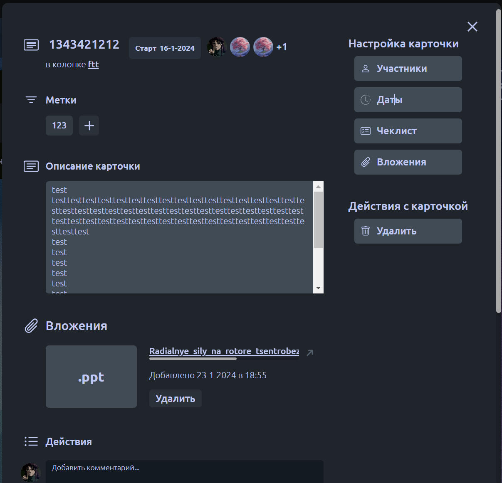
  
## Поле изменения названия карточки

* 

* При клике на название карточки необходимо изменить её название.
    * Название изменяется при нажатии Enter.
    * Название изменяется при клике в другое место.

## Создание/прикрепление тега к карточке

* 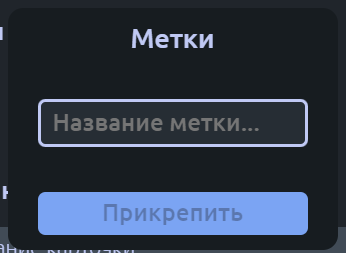

* При нажатии на кнопку "+" открывается модальное окно создания/прикрепления тега.
    * При открытии модального окна интерфейс карточки неактивным.
    * При нажатии на пространство вне окна создания/прикрепления тега это окно закрывается.
    * При вводе названия тега и нажатия кнопки "Прикрепить" создаётся/прикрепляется (в случае, если он уже есть на доске) тег к карточке (максимальное количество тегов для карточки — 3, при количестве тегов, равном 3-м, кнопка "+" скрывается).
    * При пустом инпуте кнопка "Прикрепить" заблокирована.
    * При вводе слишком большого тега выводится сообщение об ошибке: "Название тега должно быть не больше 10 символов".
    * 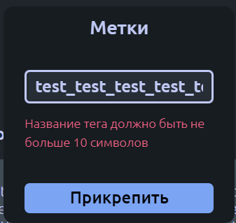
    * При вводе в названии тега чего-либо кроме букв латиницы, кириллицы, цифр и спецсимволов `$@!?#^:;%'"\*_` выводится сообщение об ошибке: "Некорректное название тега".
    * При вводе в названии тега чего-либо кроме букв латиницы, кириллицы, цифр и спецсимволов `$@!?#^:;%'"\*_` выводится сообщение об ошибке: "Некорректное название тега".
    * 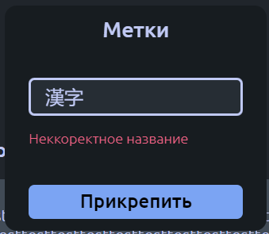 
    * При нажатии на тег, прикреплённый к карточке, открывается модальное окно взаимодействия с тегом.
    * 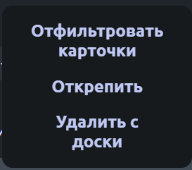
        * При открытии модального окна интерфейс карточки становится неактивным.
        * При нажатии на кнопку "Открепить" тег убирается с карточки, модальное окно не закрывается.
        * При нажатии на кнопку "Удалить" тег удаляется со всех карточек на доске, модальное окно не закрывается.
          * **_Баг_**: При удалении одного из тегов, когда их количество равно 3-м, тег удаляется, но кнопка "+" не появляется.
        * При нажатии на кнопку "Отфильтровать карточки" на доске остаются лишь карточки с выбранным тегом.

## Поле измененения описания карточки

* 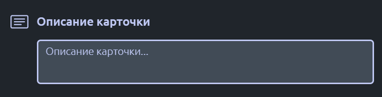

* При клике на текстовое поле под "Описание карточки" необходимо изменить её описание.
    * Описание изменяется при нажатии Enter при активном инпуте.
    * Описание изменяется при клике в другое место.
    * Перенос строки осуществляется сочетанием клавиш Shift+Enter.
    * При очень большом описании карточки появляется scrollbar.
    * 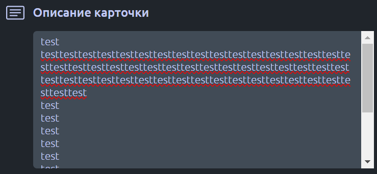
    * Допускаются к вводу все символы.

## Поле добавления комментария

* 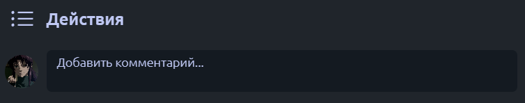

* При клике на текстовое поле под "Действия" необходимо оставить комментарий.
    * Комментарий добавляется при нажатии Enter при активном инпуте.
    * Перенос строки осуществляется сочетанием клавиш Shift+Enter.
    * При вводе текста и вводе после него пустых переносов строки последние обрезаются и в комментарий добавляется только текст.
    * При вводе сообщения с чем-либо кроме букв латиницы, кириллицы, цифр и спецсимволов `$@!?#^:;%'"\*_` выводится сообщение об ошибке: "Использованы некорректные символы в сообщении".
    * 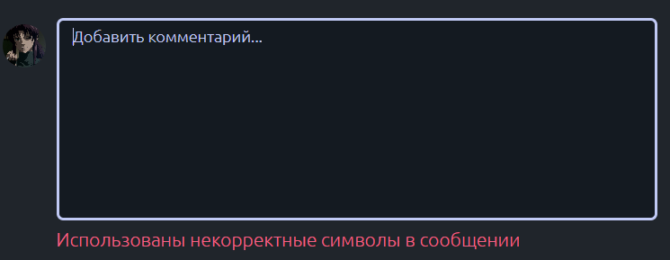
    * После ввода комментария последний добавляется перед полем ввода комментария.
    * При попытке ввода большого сообщения максимальное количество ограничивает размер сообщения.
    * 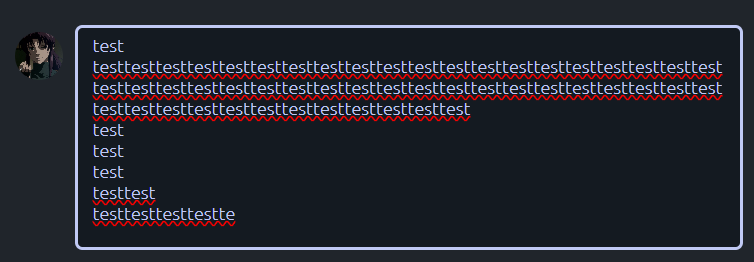

## Модальное окно добавления участников карточки

* 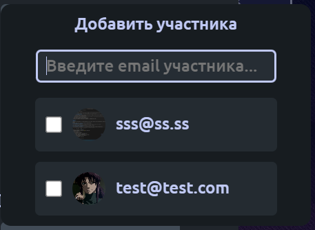

* При нажатии на кнопку "Участники" открывается модальное окно для добавления участников карточки.
    * При открытии модального окна интерфейс карточки становится неактивным.
    * При нажатии на пространство вне окна добавления участников карточки это окно закрывается.
    * При пустом инпуте отображается список со всеми участниками доски.
    * При вводе текста в поле для ввода участники доски сортируются по email, при пустом поле сортировка отключается и выводится список со всеми участниками.
    * При клике на checkbox участник добавляется на карточку и его аватар появляется справа (правее всего) от названия карточки, в самом checkbox'е внутри появляется синяя галочка.
    * 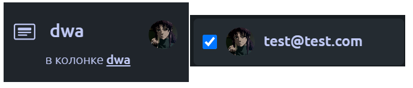
    * При клике на активный checkbox участник удаляется с карточки и его аватар справа от названия карточки пропадает.
    * Максимальное количество участников карточки равно 3-м, при превышении этого числа правее аватаров всех участников появляется надпись "+N", где N — число, равное (M-3)-м участникам карточки, при общем числе участников, равном M.
    * 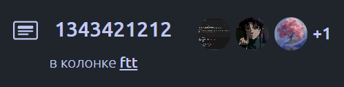

## Модальное окно добавления дат
* При нажатии на кнопку "Даты" открывается модальное окно для добавления дат карточки.
  
    * 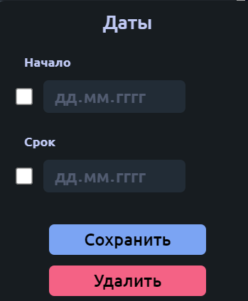

    * При открытии модального окна интерфейс карточки становится неактивным.
    * При нажатии на пространство вне окна добавления даты это окно закрывается.
    * При нажатии на checkbox под "Начало" и "Срок" активирует/выключается инпут даты начала и даты конца для карточки.
    * В поле дат необходимо вручную ввести нужную дату или использовать нативный элемент календаря, нажав на соответствующую кнопку календаря справа в инпуте.
    * При нажатии на кнопку "Сохранить" внизу модального окна справа от названия карточки появится надпись с установленными датами.
        * Если указана лишь дата "дд.мм.гггг" под "Начало", должна быть надпись "Старт дд.мм.гггг".
        * 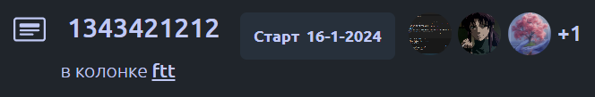 
        * Если указана лишь дата "дд.мм.гггг" под "Срок", должна быть надпись "Конец дд.мм.гггг".
        * 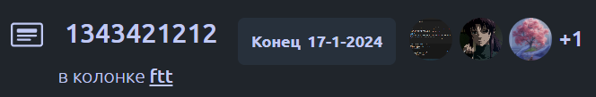 
        * Если указаны обе даты "дд1.мм1.гггг1" и "дд2.мм2.гггг2", должна быть надпись "дд1.мм1.гггг1 — дд2.мм2.гггг2".
        * 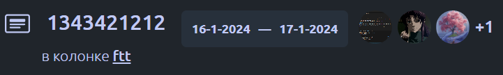 
    * При нажатии на кнопку "Сохранить" для значений дат, отличных от установленных на карточке, даты карточки обновятся.
    * При нажатии на кнопку "Удалить" внизу модального окна даты карточки (при наличии) справа от названия карточки удалятся.
        * **_Баг_**: при удалении дат и закрытии карточки не обнуляется значение поля ввода даты и checkbox остаётся активным.
        * 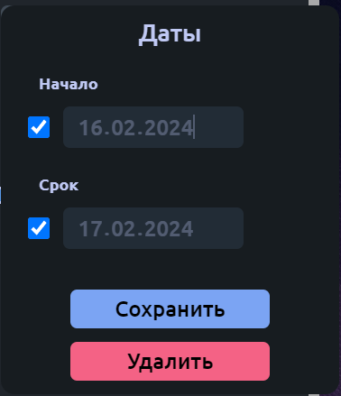
        * **_Баг_**: при установке дат месяц устанавливается неверно.
        * 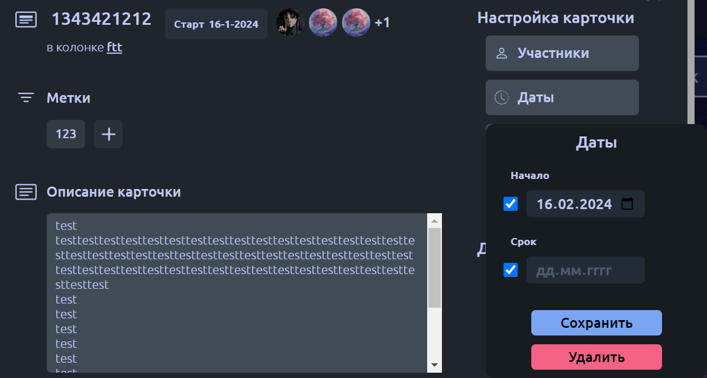
    * При попытке установить дату начала больше даты конца (или, наоборот, дату конца меньше даты начала) проведётся автокоррекция дат, при которой дата начала (конца) станет равной выбранной дате, а дата конца (начала) сдвинется на следующий (предыдущий) календарный день.

## Модальное окно добавления вложений

* 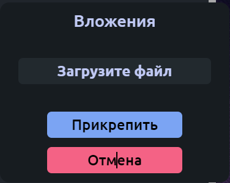

* При нажатии на кнопку "Вложения" открывается модальное окно для добавления вложений карточки.
    * При нажатии на кнопку "Загрузить файл" откроется обозреватель файлов для выбора последних.
    * После выбора файла для загрузки его название отобразится в модальном окне вложений.
    * 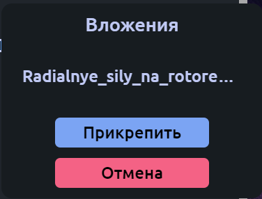 
    * При нажатии кнопки "Прикрепить" произойдёт загрузка файла вложений и вложение отобразится в самой карточке.
    * 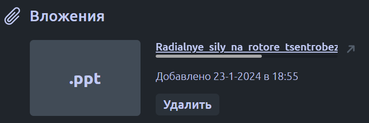
    * При нажатии кнопки "Удалить" окно вложений вернётся в исходное состояние.
    * При попытке загрузить файл больше 5 Мб выведется сообщение об ошибке.
    * 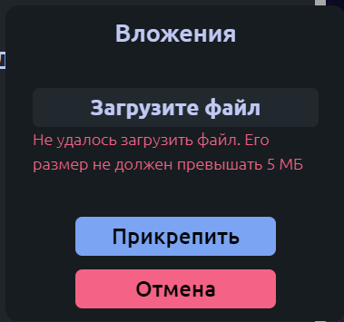

## Чеклисты

* При нажатии кнопки "Чеклист" появляется всплывающее окно с полем ввода названия чеклиста, а также кнопкой "Создать" 
* Если инпут пустой, на кнопку "Создать" нажать нельзя
* При вводе любого текста в инпут и нажатии кнопки "Создать", под полем описания появляется чеклист с соответствующим именем 
* При вводе названия чеклиста длиннее 40 символов, его конец будет обрезан без возможности его увидеть, а кнопка "Удалить" будет подвинута вправо и недоступна
* При вводе достаточно длинного названия чеклиста, отправка не совершается и выводится сообщение "Не удалось создать чеклист. Перезагрузите страницу"
* При нажатии кнопки "Удалить" удаляется соответствующий чеклист и все его элементы, а также пропадают соответствующие кнопки
* При достаточном уменьшении размера экрана, всплывающее окно налезает на слайдер окна

* В горизонтальном положении мобильной версии, при нажатии на окно ввода, появившаяся клавиатура закрывает собой или отодвигает всплывающие окна, полностью убирая возможность увидеть инпут

## Элементы чеклистов
* При нажатии кнопки "Добавить" появляется инпут для названия элемента чеклиста, а также кнопки "Сохранить" и "Отмена"
* При вводе любого текста в инпут и нажатии кнопки "Сохранить", в конец чеклиста добавляется новый элемент чеклиста с соответствующим названием.
* При нажатии кнопки "Отмена" пропадает инпут и кнопки "Сохранить" и "Отмена"
* Если текст элемента чеклиста слишком большой, появляется слайдер под названием для отображения всего текста
* При нажатии на любую часть элемента чеклиста, кроме крестика левой кнопкой мыши и её зажатии, его необходимо перенести на другую позицию в чеклисте
* При нажатии на флажок слева от названия элемента чеклиста, он помечается галочкой, при повторном нажатии он возвращается в исходное состояние
* При нажатии на крестик справа от названия чеклиста, этот элемент удаляется
