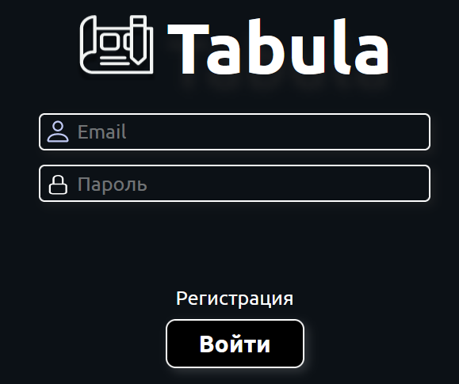
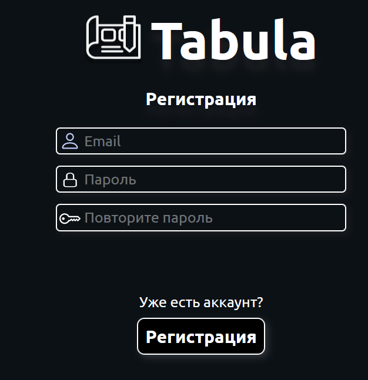
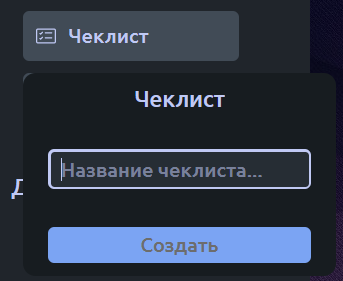
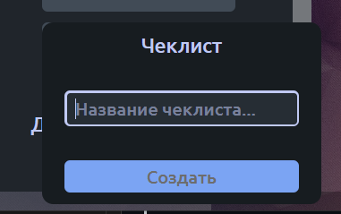

# Домашнее задание 1 по курсу QA команды ЯБлонька

## Тестовое окружение 
Windows, Chrome 106.0.4998.76

## Тестируемые части:
1. Страница авторизации
2. Страница регистрации
3. Модальное окно карточки

# Страница авторизации

## Общее
* При переходе авторизованным пользователем на страницу авторизации, пользователя перенаправляет на страницу досок
* При достаточном уменьшении окна по вертикали, пропадают изображения рядом с полями ввода
* При достаточном уменьшении окна по горизонтали, немного меняются растояния между элементами меню и их размеры
* Уменьшение окна по горизонтали ограничено, по вертикали нет
* В мобильной версии отсутствуют изображения рядом с полями ввода

## Меню входа

* Для отправки данных входа, нужно нажать на кнопку "Войти" или нажать на поле любое ввода и затем нажать клавишу Enter
* Для перехода на страницу регистрации, нужно нажать на кнопку "Регистрация"
* При вводе некорректного email, отображается надпись "Некорректный email"
* При вводе отправке пустого поля email, отображается надпись "Некорректный email", даже если пароль не введён
* При вводе логина и неверного пароля, отображается надпись "Неверный логин или пароль"
* При вводе пароля, не соответствующего требованиям, отображается надпись "Пароль должен содержать лишь латинские буквы, цифры, спецсимволы и быть длиннее 8 символов"
* При вводе верных логина и пароля, пользователя перенаправляет на страницу досок

# Страница регистрации

## Общее
* При переходе авторизованным пользователем на страницу регистрации, пользователя перенаправляет на страницу досок
* При достаточном уменьшении окна по вертикали, пропадают изображения рядом с полями ввода и текст "Регистрация"
* При достаточном уменьшении окна по горизонтали, немного меняются растояния между элементами меню и их размеры
* Уменьшение окна по горизонтали ограничено, по вертикали нет
* В мобильной версии отсутствуют изображения рядом с полями ввода

## Меню регистрации

* Для отправки данных регистрации, нужно нажать на кнопку "Регистрации" или нажать на поле любое ввода и затем нажать клавишу Enter
* Для перехода на страницу входа, нужно нажать на текст "Уже есть аккаунт?"
* При вводе некорректного email, отображается надпись "Некорректный email"
* При вводе отправке пустого поля email, отображается надпись "Некорректный email", даже если пароли не введены
* При отправке логина и пустых полей паролей, отображается надпись "Пароль должен содержать лишь латинские буквы, цифры, спецсимволы и быть длиннее 8 символов"
* При вводе пароля, не соответствующего требованиям, отображается надпись "Пароль должен содержать лишь латинские буквы, цифры, спецсимволы и быть длиннее 8 символов", даже если поле подтверждения пусто
* При несоответствии паролей в двух полях ввода, выводится сообщение "Пароли не совпадают"
* При вводе верных данных для несуществующего аккаунта, пользователя перенаправляет на страницу досок

# Модальное окно карточки

## Чеклисты

* При нажатии кнопки "Чеклист" появляется всплывающее окно с полем ввода названия чеклиста, а также кнопкой "Создать" 
* Если поле ввода пустое, на кнопку "Создать" нажать нельзя
* При вводе любого текста в поле ввода и нажатии кнопки "Создать", под полем описания появляется чеклист с соответсвенным именем 
* При вводе достаточно длинного названия чеклиста, отправка не совершается и выводится сообщение "Не удалось создать чеклист. Перезагрузите страницу"
* При нажатии кнопки "Удалить" удаляется соответствующий чеклист и все его элементы, а также пропадают соответствующие кнопки
* При достаточном уменьшении размера экрана, всплывающее окно налезает на слайдер окна

* В горизонтальном положении мобильной версии, при нажатии на окно ввода, появившаяся клавиатура закрывает собой или отодвигает всплывающие окна, полностью убирая возможность увидеть поле ввода

## Элементы чеклистов
* При нажатии кнопки "Добавить" появляется поле ввода названия элемента чеклиста, а также кнопки "Сохранить" и "Отмена"
* При вводе любого текста в поле ввода и нажатии кнопки "Сохранить", в конец чеклиста добавляется новый элемент чеклиста с соответствующим названием.
* При нажатии кнопки "Отмена" пропадает поле ввода и кнопки "Сохранить" и "Отмена"
* Если текст элемента чеклиста слишком большой, появляется слайдер под названием для отображения всего текста
* При нажатии на любую часть элемента чеклиста, кроме крестика левой кнопкой мыши и её зажатии, его можно перенести на другую позицию в чеклисте
* При нажатии на флажок слева от названия элемента чеклиста, он помечается галочкой, при повторном нажатии он возвращается в исходное состояние
* При нажатии на крестик справа от названия чеклиста, этот элемент удаляется