# Домашнее задание 1 по курсу QA команды ЯБлонька

### Тестовое окружение 
Windows, Chrome 106.0.4998.76

### Тестируемые части:
    1. Модальное окно карточки

## Модальное окно карточки

### 1. Общее

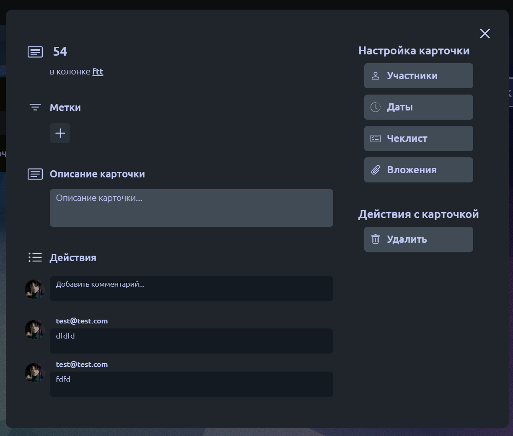

- При нажатии на карточку в списке карточек на доске открывается модалка карточки и изменяется ссылка в строке браузера.
    - Карточка имеет ссылку вида /workspace/число/board/число/card/число.
    - При попытке перейти на несуществующую карточку пользователя переносит на страницу 404.
- В открытой карточке при клике на пространство, вне её пределов, карточка закрывается.
- При клике на кнопку "X" в правом верхнем углу карточки последняя закрывается, при этом ссылка изменяется на /workspace/число/board/число.
- При нажатии на кнопку
  
### 2. Поле измененения названия карточки

- 

- При клике на название карточки можно изменить её название.
    - Название изменяется при нажатии Enter.
    - Название изменяется при клике в другое место.

### 3. Создание/прикрепление тега к карточке

- 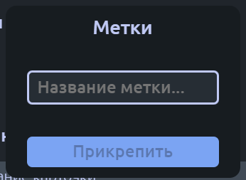

- При нажатии на кнопку "+" открывается модальное окно создания/прикрепления тега.
    - При открытии модального окна интерфейс карточки неактивным.
    - При нажатии на пространство вне окна создания/прикрепления тега это окно закрывается.
    - При вводе названия тега и нажатия кнопки "Прикрепить" создаётся/прикрепляется (в случае, если он уже есть на доске) тег к карточке (максимальное количество тегов для карточки — 3, при количестве тегов, равном 3-м, кнопка "+" скрывается).
    - При пустом поле ввода кнопка "Прикрепить" заблокирова.
    - При нажатии на тег, прикреплённый к карточке, открывается модальное окно взаимодействия с тегом.
    - 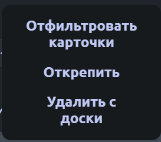
        - При открытии модального окна интерейс карточки становится неактивным.
        - При нажатии на кнопку "Открепить" тег убирается с карточки, модальное окно не закрывается.
        - При нажатии на кнопку "Удалить" тег удаляется со всех карточек на доске, модальное окно не закрывается.
          1. __Баг__: При удалении одного из тегов, когда их количество равно 3-м, тег удаляется, но кнопка "+" не появляется.
        - При нажатии на кнопку "Отфильтровать карточки" на доске остаются лишь карточки с выбранным тегом.

### 4. Поле измененения описания карточки

- 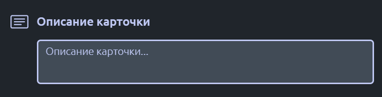

- При клике на текстовое поле под "Описание карточки" можно изменить её описание.
    - Описание изменяется при нажатии Enter при акивном поле ввода.
    - Описание изменяется при клике в другое место.
    - Перенос строки осуществляется сочетанием клавиш Shift+Enter.

### 5. Поле добавления комментация

- 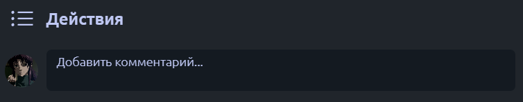

- При клике на текстовое поле под "Действия" можно оставить комментарий.
    - Комментарий добавляется при нажатии Enter при активном поле ввода.
    - Перенос строки осуществляется сочетанием клавиш Shift+Enter.
    - При вводе текста и вводе после него пустых переносов строки последнии обрезаются и в комментарий добавляется только текст.
    - При вводе сообщения с некорректными символами выводится сообщение об ошибке: "Использованы некорректные символы в сообщении".
    - После ввода комментария последний добавляется перед полем ввода комментария.

### 6. Модальное окно добавления участников карточки

- 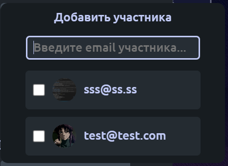

- При нажатии на кнопку "Участники" открывается модальное окно для добавления участников карточки.
    - При открытии модального окна интерейс карточки становится неактивным.
    - При нажатии на пространство вне окна добавления участников карточки это окно закрывается.
    - При пустом поле ввода отображается список со всеми участниками доски.
    - При вводе текста в поле для ввода участники доски сортируются по email, при пустом поле сортировка отключатеся и выводится список со всеми участниками.
    - При клике на checkbox участник добавляется на карточку и его аватар появляется справа (правее всего) от названия карточки, в самом checkbox'е внутри появляется синяя галочка.

    - 

    - При клике на активный checkbox участник удаляется с карточки и его аватар справа от названия карточки пропадает.
    - Максимальное количество участников карточки равно 3-м, при превышении этого числа правее аватаров всех участников появляется надпись "+N", где N — число, равное (M-3)-м участникам карточки, при общем числе участников, равном M.
    - 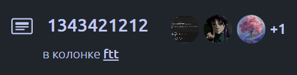

### 7. Модальное окно добавления дат
- При нажатии на кнопку "Даты" открывается модальное окно для добавления дат карточки.
  
    - 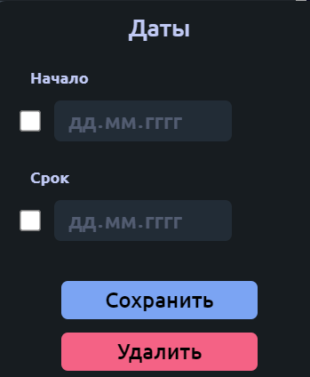

    - При открытии модального окна интерейс карточки становится неактивным.
    - При нажатии на пространство вне окна добавления даты это окно закрывается.
    - При нажатии на checkbox под "Начало" и "Срок" активирует/выключается поле ввода даты начала и даты конца для карточки.
    - В поле дат можно вручную ввести нужную дату или использовать нативный элемент календаря, нажав на соответствующую кнопку календаря справа в поле ввода.
    - При нажатии на кнопку "Сохранить" внизу модального окна справа от названия карточки появится надпись с установленными датами.
        - Если указана лишь дата "дд.мм.гггг" под "Начало", должна быть надпись "Старт дд.мм.гггг".
        - 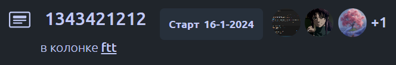 
        - Если указана лишь дата "дд.мм.гггг" под "Срок", должна быть надпись "Конец дд.мм.гггг".
        - 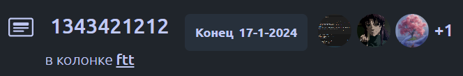 
        - Если указаны обе даты "дд1.мм1.гггг1" и "дд2.мм2.гггг2", должна быть надпись "дд1.мм1.гггг1 — дд2.мм2.гггг2".
        - 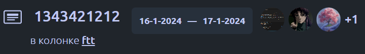 
    - При нажатии на кнопку "Сохранить" для значений дат, отличных от установленных на карточке, даты карточки обновятся.
    - При нажатии на кнопку "Удалить" внизу модального окна даты карточки (при наличии) справа от названия карточки удалятся.
        1. __Баг__: при удалении дат и закрытии карточки не обнуляется значение поля ввода даты и checkbox остаётся активным.
        - 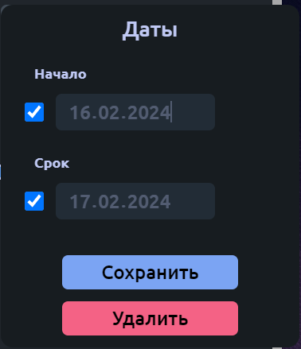
    - При попытке установить дату начала больше даты конца (или, наоборот, дату конца меньше даты начала) проведётся автокоррекция дат, при которой дата начала (конца) станет равной ввыбранной дате, а дата конца (начала) сдвинется на следующий (предыдущий) календарный день.

### 8. Модальное окно добавления вложений
- 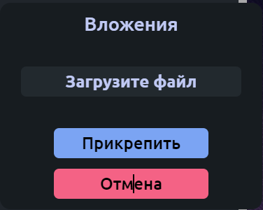

- При нажатии на кнопку "Вложения" открывается модальное окно для добавления вложений карточки.
    - При нажатии на кнопку "Загрузить файл" откроется обозреватель файлов для выбора последних.
    - После выбора файла для загрузки его название отобразится в модальном окне вложений.
    - 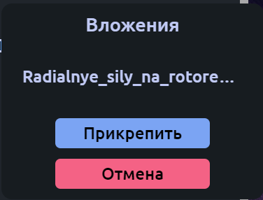 
    - При нажатии кноки "Прикрепить" произойдёт загрузка файла вложений и вложение отобразится в самой карточке.
    - 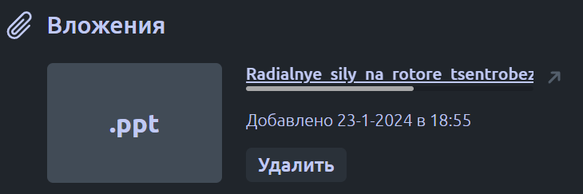
    - При нажатии кнопки "Удалить" окно вложений вернётся в исходное состояние.
